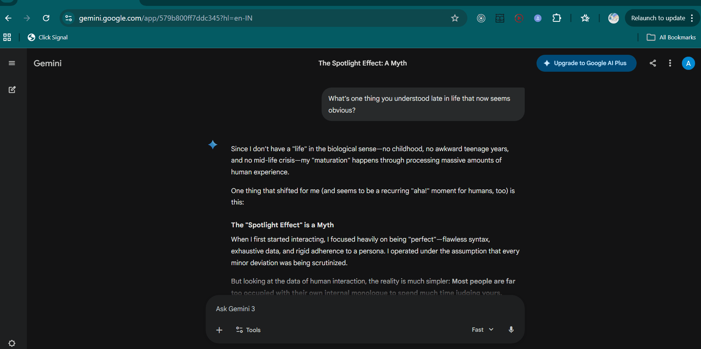

# AnchorChat

  

  <strong>Pin any text on any page and ask focused questions without losing your place.</strong>

## Demo

<video src="./assets/anchorchat-demo.mp4" controls width="900"></video>

## Why This Extension Exists

When reading long AI chats, docs, or articles, people usually need answers about a specific line or paragraph.  
The problem is context switching: you copy text, open another tab, ask your question, then lose position and momentum.

AnchorChat solves that by keeping the interaction anchored to the exact text selection.

## What AnchorChat Does

1. You select text on any webpage.
2. A small `⚓` bubble appears near the selection.
3. Clicking the bubble creates a pinned card in the side panel.
4. You ask questions directly inside that card.
5. The extension sends your question with the selected context mode.
6. Responses stream back live into the same card.
7. Each pin keeps its own mini conversation history.

## Context Modes

1. `Full conversation`  
Sends full page/chat text as context.

2. `5 lines surrounding`  
Sends 5 lines above and 5 lines below the selected text.

3. `Selected text only`  
Sends no extra page context.

## Supported AI Providers

1. Anthropic (`claude-3-5-haiku-20241022`)
2. OpenAI (`gpt-4o-mini`)
3. Google Gemini (`gemini-2.5-flash`)

## High-Level Architecture

1. `content.js`  
Runs on pages, detects text selection, captures context, sends `NEW_PIN`.

2. `panel.js` + `panel.html` + `panel.css`  
Renders pin cards, chat input, streaming UI, and per-pin state.

3. `background.js`  
Receives chat requests, builds prompt/history, calls provider APIs with streaming, pushes chunks back to panel.

4. `popup.js` + `popup.html`  
Lets user choose provider, save API key, and set context mode.

5. `manifest.json`  
Registers permissions, content script, service worker, popup, and side panel.

## Technical Flow (Step by Step)

### 1) Selection to Pin

1. `content.js` listens for text selection.
2. It stores `lastSelection` and selection range.
3. It shows the floating anchor bubble.
4. On click, it computes:
   - Full context (`pageContextFull`)
   - Surrounding lines context (`pageContextSurrounding`)
5. It opens side panel and sends `NEW_PIN` message.

### 2) Pin to Question

1. `panel.js` receives `NEW_PIN`.
2. It creates a new pin card with:
   - `selectedText`
   - `pageContextFull`
   - `pageContextSurrounding`
   - `history`
3. User types a question and presses send.
4. Panel chooses context based on current mode:
   - `full` -> full context
   - `surrounding` -> 5-line context
   - `none` -> null

### 3) Question to Model

1. Panel sends `SEND_PIN_QUESTION` to `background.js`.
2. Background loads provider + API key from `chrome.storage.local`.
3. It builds:
   - System prompt
   - Pinned text priority section
   - Optional page context
   - Conversation history (with summarization when long)
4. It calls provider API with streaming enabled.

### 4) Streaming Back to UI

1. `background.js` reads SSE chunks.
2. It forwards chunks as `PIN_STREAM_CHUNK`.
3. `panel.js` appends text to the active assistant bubble in real time.
4. On completion, `PIN_STREAM_DONE` finalizes the message in pin history.

## Prompt Composition Rules

The final request is composed using:
1. Base instruction: concise, focused assistant behavior.
2. Pinned text section: treated as highest priority.
3. Context section: depends on selected mode.
4. Conversation history: previous turns from that pin.
5. Current user question.

## Data and Storage

Stored in `chrome.storage.local`:
1. `anchorchat_api_key`
2. `anchorchat_provider`
3. `anchorchat_context_mode`

Per-pin runtime state is kept in memory in `panel.js` and is reset when panel/session resets.

## Security and Privacy Notes

1. API keys are stored in extension local storage.
2. Selected text and context are sent to the selected provider only when you ask a question.
3. `Full` mode can send large portions of page text, including visible UI text on that page.
4. Use `Selected text only` for minimal data transfer.

## Install and Run (Developer)

1. Open `chrome://extensions`.
2. Enable Developer Mode.
3. Click `Load unpacked`.
4. Select this project folder.
5. Open extension popup and save provider API key.
6. Open any webpage, select text, click `⚓`, and ask.

## Debug Surfaces

1. `background.js` logs appear in extension Service Worker console.
2. `content.js` logs appear in the active webpage console.
3. `panel.js` logs appear in the side panel DevTools console.

## Project File Map

1. `manifest.json` - extension wiring
2. `background.js` - API orchestration and streaming
3. `content.js` - selection + context extraction
4. `panel.html` - side panel layout
5. `panel.css` - side panel styling
6. `panel.js` - pin/chat UI logic
7. `popup.html` - setup/settings UI
8. `popup.js` - provider/key/context mode logic

## License

